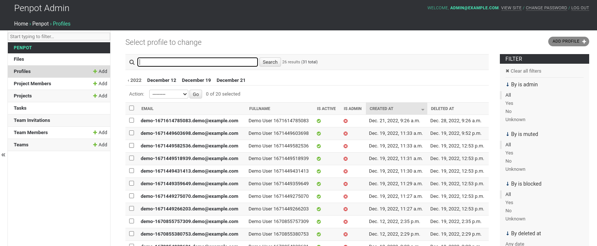

[uri_license]: https://www.mozilla.org/en-US/MPL/2.0
[uri_license_image]: https://img.shields.io/badge/MPL-2.0-blue.svg

<h1 align="center">
  <br>
  
  <br>
  PENPOT ADMIN
</h1>

<p align="center">
    <a href="https://www.mozilla.org/en-US/MPL/2.0" rel="nofollow"></a>
    <a href="https://tree.taiga.io/project/penpot/" title="Managed with Taiga.io" rel="nofollow">
        </a>
</p>

<p align="center">
  <a href="https://penpot.app/"><b>Penpot Website</b></a> •
  <a href="https://community.penpot.app/"><b>Penpot Community</b></a>
</p>

<p align="center">
  
</p>

This is a **very early-stage** admin application for penpot.

## Getting Started

For a quick examplo on how it can be used, please refer to the [penpot
docker compose][1] file for an example for how it can be used.

You should be aware that this is an ongoing work and should be
considered **EXPERIMENTAL**.

## Important Notes

- This application is built using django admin facilites, so on using it, it will create
  some django related tables on the same database as penpot backend. The database is
  shared between the penpot-admin and penpot-backend.
- The penpot-admin communicates with penpot-backend using plain sockets and PREPL, **do
  not expose PREPL port to the internet**.
- Right now it is in very early stage of development and can be considered a limit MVP
  application that we will going to enhace over time and user feedback/requests. So if you
  found an error or do you miss something, feel free to open an issue.


## License ##

```
This Source Code Form is subject to the terms of the Mozilla Public
License, v. 2.0. If a copy of the MPL was not distributed with this
file, You can obtain one at http://mozilla.org/MPL/2.0/.

Copyright (c) KALEIDOS INC
```
Penpot and the Penpot Admin are Kaleidos’ [open source projects](https://kaleidos.net/products)

[1]: https://github.com/penpot/penpot/blob/develop/docker/images/docker-compose.yaml
